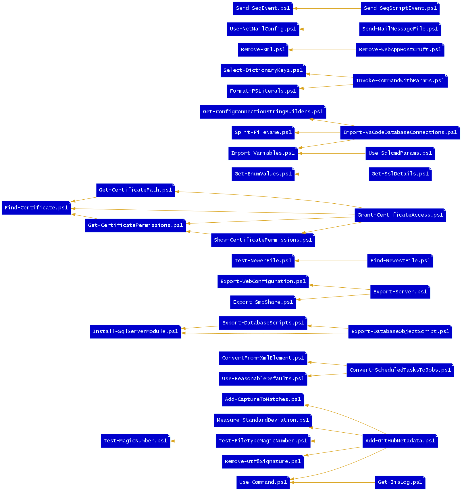

Useful General-Purpose Scripts
==============================
This repo contains a collection of generally useful scripts (mostly Windows, mostly PowerShell).

PowerShell Scripts
------------------

- **[Add-CapturesToMatches.ps1](Add-CapturesToMatches.ps1)**: Adds named capture groups as note properties to Select-String's MatchInfo objects.
- **[Add-GitHubMetadata.ps1](Add-GitHubMetadata.ps1)**: Adds GitHub Linguist overrides to a repo's .gitattributes.
- **[Add-Xml.ps1](Add-Xml.ps1)**: Insert XML into an XML document relative to a node found by Select-Xml.
- **[Backup-File.ps1](Backup-File.ps1)**: Create a backup as a sibling to a file, with date and time values in the name.
- **[Backup-SchTasks.ps1](Backup-SchTasks.ps1)**: Exports the local list of Scheduled Tasks into a single XML file.
- **[Convert-ScheduledTasksToJobs.ps1](Convert-ScheduledTasksToJobs.ps1)**: Converts Scheduled Tasks to Scheduled Jobs.
- **[ConvertFrom-DataRow.ps1](ConvertFrom-DataRow.ps1)**: Converts a DataRow object to a PSObject.
- **[ConvertFrom-EscapedXml.ps1](ConvertFrom-EscapedXml.ps1)**: Parse escaped XML into XML and serialize it.
- **[ConvertFrom-XmlElement.ps1](ConvertFrom-XmlElement.ps1)**: Converts named nodes of an element to properties of a PSObject, recursively.
- **[ConvertTo-BasicAuthentication.ps1](ConvertTo-BasicAuthentication.ps1)**: Produces a basic authentication header string from a credential.
- **[ConvertTo-LogParserTimestamp.ps1](ConvertTo-LogParserTimestamp.ps1)**: Formats a datetime as a LogParser literal.
- **[ConvertTo-OrderedDictionary.ps1](ConvertTo-OrderedDictionary.ps1)**: Converts an object to an ordered dictionary of properties and values.
- **[Copy-SchTasks.ps1](Copy-SchTasks.ps1)**: Copy scheduled jobs from another computer to this one, using a GUI list to choose jobs.
- **[Export-DatabaseObjectScript.ps1](Export-DatabaseObjectScript.ps1)**: Exports MS SQL script for an object from the given server.
- **[Export-DatabaseScripts.ps1](Export-DatabaseScripts.ps1)**: Exports MS SQL database objects from the given server and database as files, into a consistent folder structure.
- **[Export-Readme.ps1](Export-Readme.ps1)**: Generate README.md file for the scripts repo.
- **[Export-ScheduledJobs.ps1](Export-ScheduledJobs.ps1)**: Exports scheduled jobs as a PowerShell script that can be run to restore them.
- **[Export-ScheduledTasks.ps1](Export-ScheduledTasks.ps1)**: Exports scheduled tasks as a PowerShell script that can be run to restore them.
- **[Export-SmbShares.ps1](Export-SmbShares.ps1)**: Export SMB shares using old NET SHARE command, to new New-SmbShare PowerShell commands.
- **[Export-TableMerge.ps1](Export-TableMerge.ps1)**: Exports table data as a T-SQL MERGE statement.
- **[Export-WebConfiguration.ps1](Export-WebConfiguration.ps1)**: Exports IIS websites, app pools, and web apps as an idempotent PowerShell script to recreate them.
- **[Find-Certificate.ps1](Find-Certificate.ps1)**: Searches a certificate store for certificates.
- **[Find-Lines.ps1](Find-Lines.ps1)**: Searches a specific subset of files for lines matching a pattern.
- **[Find-NewestFile.ps1](Find-NewestFile.ps1)**: Finds the most recent file.
- **[Find-ProjectPackages.ps1](Find-ProjectPackages.ps1)**: Find modules used in projects.
- **[Find-SqlDeprecatedLargeValueTypes.ps1](Find-SqlDeprecatedLargeValueTypes.ps1)**: Reports text, ntext, and image datatypes found in a given database.
- **[Format-ByteUnits.ps1](Format-ByteUnits.ps1)**: Converts bytes to largest possible units, to improve readability.
- **[Format-HtmlDataTable.ps1](Format-HtmlDataTable.ps1)**: Right-aligns numeric data in an HTML table for emailing, and optionally zebra-stripes &c.
- **[Format-PSLiterals.ps1](Format-PSLiterals.ps1)**: Serializes complex content into PowerShell literals.
- **[Format-Xml.ps1](Format-Xml.ps1)**: Pretty-print XML.
- **[Format-XmlElements.ps1](Format-XmlElements.ps1)**: Serializes complex content into XML elements.
- **[Get-AspNetEvents.ps1](Get-AspNetEvents.ps1)**: Parses ASP.NET errors from the event log on the given server.
- **[Get-CertificateExpiration.ps1](Get-CertificateExpiration.ps1)**: Returns HTTPS certificate expiration and other cert info for a host.
- **[Get-CertificatePath.ps1](Get-CertificatePath.ps1)**: Gets the physical path on disk of a certificate.
- **[Get-CertificatePermissions.ps1](Get-CertificatePermissions.ps1)**: Returns the permissions of a certificate's private key file.
- **[Get-CharacterDetails.ps1](Get-CharacterDetails.ps1)**: Returns filterable categorical information about characters in the Unicode Basic Multilingual Plane.
- **[Get-CommandPath.ps1](Get-CommandPath.ps1)**: Locates a command.
- **[Get-ConfigConnectionStringBuilders.ps1](Get-ConfigConnectionStringBuilders.ps1)**: Return named connection string builders for connection strings in a config file.
- **[Get-EnumValues.ps1](Get-EnumValues.ps1)**: Returns the possible values of the specified enumeration.
- **[Get-IisLog.ps1](Get-IisLog.ps1)**: Easily query IIS logs.
- **[Get-LibraryVulnerabilityInfo.ps1](Get-LibraryVulnerabilityInfo.ps1)**: Get the list of module/package/library vulnerabilities from the RetireJS or SafeNuGet projects.
- **[Get-NetFrameworkVersions.ps1](Get-NetFrameworkVersions.ps1)**: Determine which .NET Frameworks are installed on the requested system.
- **[Get-SystemDetails.ps1](Get-SystemDetails.ps1)**: Collects some useful system hardware and operating system details via WMI.
- **[Get-TypeAccelerators.ps1](Get-TypeAccelerators.ps1)**: Returns the list of PowerShell type accelerators.
- **[Grant-CertificateAccess.ps1](Grant-CertificateAccess.ps1)**: Grants certificate file read access to an app pool or user.
- **[Import-Variables.ps1](Import-Variables.ps1)**: Creates local variables from a data row or dictionary (hashtable).
- **[Import-VsCodeDatabaseConnections.ps1](Import-VsCodeDatabaseConnections.ps1)**: Adds config XDT connection strings to VSCode settings.
- **[Install-ActiveDirectoryModule.ps1](Install-ActiveDirectoryModule.ps1)**: Installs the PowerShell ActiveDirectory module.
- **[Install-SqlServerModule.ps1](Install-SqlServerModule.ps1)**: Installs SqlServer module and dependencies.
- **[Invoke-CommandWithParams.ps1](Invoke-CommandWithParams.ps1)**: Execute a command by using matching dictionary entries as parameters.
- **[Join-FileName.ps1](Join-FileName.ps1)**: Combines a filename with a string.
- **[Measure-Indents.ps1](Measure-Indents.ps1)**: Measures the indentation characters used in a text file.
- **[Measure-StandardDeviation.ps1](Measure-StandardDeviation.ps1)**: Calculate the standard deviation of numeric values.
- **[New-DbProviderObject.ps1](New-DbProviderObject.ps1)**: Create a common database object.
- **[Optimize-Path.ps1](Optimize-Path.ps1)**: Sorts, prunes, and normalizes both user and system Path entries.
- **[Read-Choice.ps1](Read-Choice.ps1)**: Returns choice selected from a list of options.
- **[Remove-LockyFile.ps1](Remove-LockyFile.ps1)**: Removes a file that may be prone to locking.
- **[Remove-WebAppHostCruft.ps1](Remove-WebAppHostCruft.ps1)**: Removes unused web application settings that have accumulated.
- **[Remove-Xml.ps1](Remove-Xml.ps1)**: Removes a node found by Select-Xml from its XML document.
- **[Repair-DatabaseConstraintNames.ps1](Repair-DatabaseConstraintNames.ps1)**: Finds database constraints with system-generated names and gives them deterministic names.
- **[Restore-SchTasks.ps1](Restore-SchTasks.ps1)**: Imports from a single XML file into the local Scheduled Tasks.
- **[Select-DictionaryKeys.ps1](Select-DictionaryKeys.ps1)**: Constructs an OrderedDictionary by selecting keys from a given IDictionary.
- **[Select-XmlNodeValue.ps1](Select-XmlNodeValue.ps1)**: Returns the value of an XML node found by Select-Xml.
- **[Send-MailMessageFile.ps1](Send-MailMessageFile.ps1)**: Sends emails from a drop folder using .NET config defaults.
- **[Send-SeqEvent.ps1](Send-SeqEvent.ps1)**: Send an event to a Seq server.
- **[Send-SeqScriptEvent.ps1](Send-SeqScriptEvent.ps1)**: Sends an event (often an error) from a script to a Seq server, including script info.
- **[Send-SqlReport.ps1](Send-SqlReport.ps1)**: Execute a SQL statement and email the results.
- **[Set-XmlAttribute.ps1](Set-XmlAttribute.ps1)**: Adds an XML attribute to an XML element found by Select-Xml.
- **[Set-XmlNodeValue.ps1](Set-XmlNodeValue.ps1)**: Sets the value of a node found by Select-Xml.
- **[Show-CertificatePermissions.ps1](Show-CertificatePermissions.ps1)**: Shows the permissions of a certificate's private key file.
- **[Show-DataRef.ps1](Show-DataRef.ps1)**: Display an HTML view of an XML schema or WSDL using Saxon.
- **[Split-FileName.ps1](Split-FileName.ps1)**: Returns the specified part of the filename.
- **[Test-DateTime.ps1](Test-DateTime.ps1)**: Tests whether the given string can be parsed as a date.
- **[Test-HttpSecurity.ps1](Test-HttpSecurity.ps1)**: Scan sites using Mozilla's Observatory.
- **[Test-Interactive.ps1](Test-Interactive.ps1)**: Determines whether both the user and process are interactive.
- **[Test-NewerFile.ps1](Test-NewerFile.ps1)**: Returns true if the difference file is newer than the reference file.
- **[Test-USFederalHoliday.ps1](Test-USFederalHoliday.ps1)**: Returns the name of the holiday of a date, if it is a U.S. federal holiday.
- **[Test-Xml.ps1](Test-Xml.ps1)**: Try parsing text as XML.
- **[Update-Files.ps1](Update-Files.ps1)**: Copies specified source files that exist in the destination directory.
- **[Use-Command.ps1](Use-Command.ps1)**: Checks for the existence of the given command, and adds if missing and a source is defined.
- **[Use-NetMailConfig.ps1](Use-NetMailConfig.ps1)**: Use .NET configuration to set defaults for Send-MailMessage.
- **[Use-ReasonableDefaults.ps1](Use-ReasonableDefaults.ps1)**: Sets certain cmdlet parameter defaults to rational, useful values.
- **[Use-SeqServer.ps1](Use-SeqServer.ps1)**: Set the default Server and ApiKey for Send-SeqEvent.ps1
- **[Use-SqlcmdParams.ps1](Use-SqlcmdParams.ps1)**: Use the calling script parameters to set Invoke-Sqlcmd defaults.

F# Scripts
----------
- **[ExampleEmailReport.fsx](https://cdn.rawgit.com/brianary/scripts/master/ExampleEmailReport.html)**: Builds a chart and attaches it to an email, then sends it.
- **[US Federal Holiday Detection](https://cdn.rawgit.com/brianary/scripts/master/USFederalHolidays.html)**: Here's how to determine whether a date is a US federal holiday using F#.

Office VBA Scripts
------------------
- **[OutlookExpireTag.vba](OutlookExpireTag.vba)**: Too many emails remain beyond their period of relevance: daily personnel schedule changes, found item notices, office food notices, server reboot notices, weather/traffic warnings, &c. This Outlook script will allow specifying an expiration date as a hashtag in the subject of outgoing emails, since Outlook does such a good job of hiding the UI for that field. -BL 
- **[OutlookPasteFormattedIndented.vba](OutlookPasteFormattedIndented.vba)**: Outlook will strip single-space indents when displaying emails. If you've got, for example, syntax highlighted source code that employs any indentation of only one space, you'll want to add two spaces to the each line (adding one will not appear for text that isn't indented). This Outlook script will paste formatted text, and indent it. Requires Tools -> References -> Microsoft Word 14.0 Object Library (later versions may also work) 
- **[OutlookPasteTsvTable.vba](OutlookPasteTsvTable.vba)**: This Outlook VBA Sub can be connected to a toolbar button for pasting TSV data as an attractive, formatted table. -BL Requires Tools -> References -> Microsoft Word 14.0 Object Library (later versions may also work) 

<!-- generated 12/14/2017 17:25:43 -->
