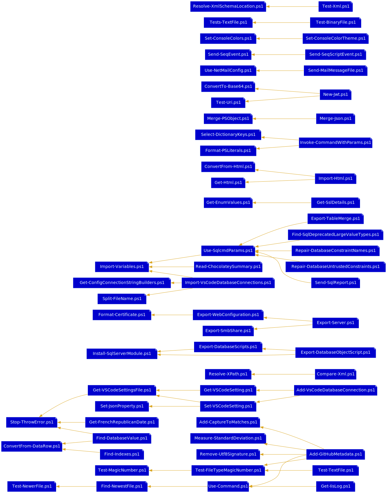

Useful General-Purpose Scripts
==============================
This repo contains a collection of generally useful scripts (mostly Windows, mostly PowerShell 5).

PowerShell Scripts
------------------

- **[Add-CapturesToMatches.ps1](Add-CapturesToMatches.ps1)**: Adds named capture groups as note properties to Select-String's MatchInfo objects.
- **[Add-DynamicParam.ps1](Add-DynamicParam.ps1)**: Adds a dynamic parameter to a script, within a DynamicParam block.
- **[Add-GitHubMetadata.ps1](Add-GitHubMetadata.ps1)**: Adds GitHub Linguist overrides to a repo's .gitattributes.
- **[Add-NoteProperty.ps1](Add-NoteProperty.ps1)**: Adds a NoteProperty to a PSObject, calculating the value with the object in context.
- **[Add-TimeSpan.ps1](Add-TimeSpan.ps1)**: Adds a timespan to DateTime values.
- **[Add-Utf8Signature.ps1](Add-Utf8Signature.ps1)**: Adds the utf-8 signature (BOM) from a file.
- **[Add-VsCodeDatabaseConnection.ps1](Add-VsCodeDatabaseConnection.ps1)**: Adds a VS Code MSSQL database connection to the repo.
- **[Add-Xml.ps1](Add-Xml.ps1)**: Insert XML into an XML document relative to a node found by Select-Xml.
- **[Backup-File.ps1](Backup-File.ps1)**: Create a backup as a sibling to a file, with date and time values in the name.
- **[Backup-SchTasks.ps1](Backup-SchTasks.ps1)**: Exports the local list of Scheduled Tasks into a single XML file.
- **[Convert-ScheduledTasksToJobs.ps1](Convert-ScheduledTasksToJobs.ps1)**: Converts Scheduled Tasks to Scheduled Jobs.
- **[Convert-Xml.ps1](Convert-Xml.ps1)**: Transform XML using an XSLT template.
- **[ConvertFrom-Base64.ps1](ConvertFrom-Base64.ps1)**: Converts base-64-encoded text to bytes or text.
- **[ConvertFrom-CimInstance.ps1](ConvertFrom-CimInstance.ps1)**: Convert a CimInstance object to a PSObject.
- **[ConvertFrom-DataRow.ps1](ConvertFrom-DataRow.ps1)**: Converts a DataRow object to a PSObject, Hashtable, or single value.
- **[ConvertFrom-Duration.ps1](ConvertFrom-Duration.ps1)**: Parses a Timespan from a ISO8601 duration string.
- **[ConvertFrom-EscapedXml.ps1](ConvertFrom-EscapedXml.ps1)**: Parse escaped XML into XML and serialize it.
- **[ConvertFrom-Html.ps1](ConvertFrom-Html.ps1)**: Parses an HTML table into objects.
- **[ConvertFrom-UserAgent.ps1](ConvertFrom-UserAgent.ps1)**: Parse an HTTP User-Agent string.
- **[ConvertFrom-XmlElement.ps1](ConvertFrom-XmlElement.ps1)**: Converts named nodes of an element to properties of a PSObject, recursively.
- **[ConvertTo-Base64.ps1](ConvertTo-Base64.ps1)**: Converts bytes or text to base-64-encoded text.
- **[ConvertTo-BasicAuthentication.ps1](ConvertTo-BasicAuthentication.ps1)**: Produces a basic authentication header string from a credential.
- **[ConvertTo-EpochTime.ps1](ConvertTo-EpochTime.ps1)**: Converts a DateTime value into an integer Unix (POSIX) time, seconds since Jan 1, 1970.
- **[ConvertTo-LogParserTimestamp.ps1](ConvertTo-LogParserTimestamp.ps1)**: Formats a datetime as a LogParser literal.
- **[ConvertTo-MultipartFormData.ps1](ConvertTo-MultipartFormData.ps1)**: Creates multipart/form-data to send as a request body.
- **[ConvertTo-OrderedDictionary.ps1](ConvertTo-OrderedDictionary.ps1)**: Converts an object to an ordered dictionary of properties and values.
- **[Copy-SchTasks.ps1](Copy-SchTasks.ps1)**: Copy scheduled jobs from another computer to this one, using a GUI list to choose jobs.
- **[Disable-Certificate.ps1](Disable-Certificate.ps1)**: Sets the Archived property on a certificate.
- **[Disable-NetStrongCrypto.ps1](Disable-NetStrongCrypto.ps1)**: Disable strong crypto for .NET 3.5 & 4.5.
- **[Enable-Certificate.ps1](Enable-Certificate.ps1)**: Unsets the Archived property on a certificate.
- **[Enable-NetStrongCrypto.ps1](Enable-NetStrongCrypto.ps1)**: Enable strong crypto for .NET 3.5 & 4.5.
- **[Export-DatabaseObjectScript.ps1](Export-DatabaseObjectScript.ps1)**: Exports MS SQL script for an object from the given server.
- **[Export-DatabaseScripts.ps1](Export-DatabaseScripts.ps1)**: Exports MS SQL database objects from the given server and database as files, into a consistent folder structure.
- **[Export-Fake4TargetsGraph.ps1](Export-Fake4TargetsGraph.ps1)**: Exports a graph of a Fake4 build script's targets.
- :up: **[Export-Readme.ps1](Export-Readme.ps1)**: Generate README.md file for the scripts repo.
- **[Export-ScheduledJobs.ps1](Export-ScheduledJobs.ps1)**: Exports scheduled jobs as a PowerShell script that can be run to restore them.
- **[Export-ScheduledTasks.ps1](Export-ScheduledTasks.ps1)**: Exports scheduled tasks as a PowerShell script that can be run to restore them.
- **[Export-Server.ps1](Export-Server.ps1)**: Exports web server settings, shares, ODBC DSNs, and installed MSAs as PowerShell scripts and data.
- **[Export-SmbShares.ps1](Export-SmbShares.ps1)**: Export SMB shares using old NET SHARE command, to new New-SmbShare PowerShell commands.
- **[Export-TableMerge.ps1](Export-TableMerge.ps1)**: Exports table data as a T-SQL MERGE statement.
- **[Export-WebConfiguration.ps1](Export-WebConfiguration.ps1)**: Exports IIS websites, app pools, and web apps as an idempotent PowerShell script to recreate them.
- **[Find-Certificate.ps1](Find-Certificate.ps1)**: Searches a certificate store for certificates.
- **[Find-DatabaseValue.ps1](Find-DatabaseValue.ps1)**: Searches an entire database for a field value.
- **[Find-DuplicateFiles.ps1](Find-DuplicateFiles.ps1)**: Removes duplicates from a list of files.
- **[Find-Indexes.ps1](Find-Indexes.ps1)**: Returns indexes using a column with the given name.
- **[Find-InstalledPrograms.ps1](Find-InstalledPrograms.ps1)**: Searches installed programs.
- **[Find-Lines.ps1](Find-Lines.ps1)**: Searches a specific subset of files for lines matching a pattern.
- **[Find-NewestFile.ps1](Find-NewestFile.ps1)**: Finds the most recent file.
- **[Find-ProjectPackages.ps1](Find-ProjectPackages.ps1)**: Find modules used in projects.
- **[Find-SqlDeprecatedLargeValueTypes.ps1](Find-SqlDeprecatedLargeValueTypes.ps1)**: Reports text, ntext, and image datatypes found in a given database.
- **[Format-ByteUnits.ps1](Format-ByteUnits.ps1)**: Converts bytes to largest possible units, to improve readability.
- **[Format-Certificate.ps1](Format-Certificate.ps1)**: Generates a formatted name/description from a certificate.
- **[Format-EscapedUrl.ps1](Format-EscapedUrl.ps1)**: Escape URLs more aggressively.
- **[Format-HtmlDataTable.ps1](Format-HtmlDataTable.ps1)**: Right-aligns numeric data in an HTML table for emailing, and optionally zebra-stripes &c.
- **[Format-Permutations.ps1](Format-Permutations.ps1)**: Builds format strings using every combination of elements from multiple arrays.
- **[Format-PSLiterals.ps1](Format-PSLiterals.ps1)**: Serializes complex content into PowerShell literals.
- **[Format-Xml.ps1](Format-Xml.ps1)**: Pretty-print XML.
- **[Format-XmlElements.ps1](Format-XmlElements.ps1)**: Serializes complex content into XML elements.
- **[Get-AspNetEvents.ps1](Get-AspNetEvents.ps1)**: Parses ASP.NET errors from the event log on the given server.
- **[Get-AssemblyFramework.ps1](Get-AssemblyFramework.ps1)**: Gets the framework version an assembly was compiled for.
- **[Get-CertificatePath.ps1](Get-CertificatePath.ps1)**: Gets the physical path on disk of a certificate's private key.
- **[Get-CertificatePermissions.ps1](Get-CertificatePermissions.ps1)**: Returns the permissions of a certificate's private key file.
- **[Get-CharacterDetails.ps1](Get-CharacterDetails.ps1)**: Returns filterable categorical information about characters in the Unicode Basic Multilingual Plane.
- **[Get-ClassicAspEvents.ps1](Get-ClassicAspEvents.ps1)**: Gets Classic ASP errors from the event log on the given server.
- **[Get-CommandPath.ps1](Get-CommandPath.ps1)**: Locates a command.
- **[Get-ConfigConnectionStringBuilders.ps1](Get-ConfigConnectionStringBuilders.ps1)**: Return named connection string builders for connection strings in a config file.
- **[Get-ConsoleColors.ps1](Get-ConsoleColors.ps1)**: Gets current console color details.
- **[Get-ContentSecurityPolicy.ps1](Get-ContentSecurityPolicy.ps1)**: Returns the content security policy at from the given URL.
- **[Get-Dns.ps1](Get-Dns.ps1)**: Looks up DNS info, given a hostname or address.
- **[Get-EnumValues.ps1](Get-EnumValues.ps1)**: Returns the possible values of the specified enumeration.
- **[Get-Html.ps1](Get-Html.ps1)**: Gets elements from a web response by tag name.
- **[Get-IisLog.ps1](Get-IisLog.ps1)**: Easily query IIS logs.
- **[Get-LibraryVulnerabilityInfo.ps1](Get-LibraryVulnerabilityInfo.ps1)**: Get the list of module/package/library vulnerabilities from the RetireJS or SafeNuGet projects.
- **[Get-NetFrameworkVersions.ps1](Get-NetFrameworkVersions.ps1)**: Determine which .NET Frameworks are installed on the requested system.
- **[Get-RepoName.ps1](Get-RepoName.ps1)**: Gets the name of the repo.
- **[Get-SslDetails.ps1](Get-SslDetails.ps1)**: Enumerates the SSL protocols that the client is able to successfully use to connect to a server.
- **[Get-SystemDetails.ps1](Get-SystemDetails.ps1)**: Collects some useful system hardware and operating system details via WMI.
- **[Get-TypeAccelerators.ps1](Get-TypeAccelerators.ps1)**: Returns the list of PowerShell type accelerators.
- **[Get-WebRequestBody.ps1](Get-WebRequestBody.ps1)**: Listens on a given port of the localhost, returning the body of a single web request, and responding with an empty 204.
- **[Get-XmlNamespaces.ps1](Get-XmlNamespaces.ps1)**: Gets the namespaces from a document as a dictionary.
- **[Grant-CertificateAccess.ps1](Grant-CertificateAccess.ps1)**: Grants certificate file read access to an app pool or user.
- **[Import-Html.ps1](Import-Html.ps1)**: Imports from an HTML table's rows, given a URL.
- **[Import-Variables.ps1](Import-Variables.ps1)**: Creates local variables from a data row or dictionary (hashtable).
- **[Import-VsCodeDatabaseConnections.ps1](Import-VsCodeDatabaseConnections.ps1)**: Adds config XDT connection strings to VSCode settings.
- **[Install-ActiveDirectoryModule.ps1](Install-ActiveDirectoryModule.ps1)**: Durably installs the PowerShell ActiveDirectory module.
- **[Install-SqlServerModule.ps1](Install-SqlServerModule.ps1)**: Installs SqlServer module and dependencies.
- **[Invoke-CommandWithParams.ps1](Invoke-CommandWithParams.ps1)**: Execute a command by using matching dictionary entries as parameters.
- **[Join-FileName.ps1](Join-FileName.ps1)**: Combines a filename with a string.
- :up: **[Measure-DbColumn.ps1](Measure-DbColumn.ps1)**: Provides statistics about SQL Server column data.
- **[Measure-Indents.ps1](Measure-Indents.ps1)**: Measures the indentation characters used in a text file.
- **[Measure-StandardDeviation.ps1](Measure-StandardDeviation.ps1)**: Calculate the standard deviation of numeric values.
- **[Merge-Json.ps1](Merge-Json.ps1)**: Create a new JSON string by recursively combining the properties of JSON strings.
- **[Merge-PSObject.ps1](Merge-PSObject.ps1)**: Create a new PSObject by recursively combining the properties of PSObjects.
- **[New-DbProviderObject.ps1](New-DbProviderObject.ps1)**: Create a common database object.
- :up: **[New-Jwt.ps1](New-Jwt.ps1)**: Generates a JSON Web Token (JWT)
- **[New-Password.ps1](New-Password.ps1)**: Generate a new password.
- **[New-Script.ps1](New-Script.ps1)**: Creates a simple boilerplate script.
- **[New-Shortcut.ps1](New-Shortcut.ps1)**: Create a Windows shortcut.
- **[Optimize-Path.ps1](Optimize-Path.ps1)**: Sorts, prunes, and normalizes both user and system Path entries.
- **[Push-WorkspaceLocation.ps1](Push-WorkspaceLocation.ps1)**: Pushes the current VS Code editor workspace location to the location stack.
- :new: **[Read-ChocolateySummary.ps1](Read-ChocolateySummary.ps1)**: Retrieves the a summary from the Chocolatey log.
- **[Read-Choice.ps1](Read-Choice.ps1)**: Returns choice selected from a list of options.
- **[Read-WebRequest.ps1](Read-WebRequest.ps1)**: Parses an HTTP listener request.
- **[Receive-WebRequest.ps1](Receive-WebRequest.ps1)**: Listens for an HTTP request and returns an HTTP request & response.
- **[Remove-LockyFile.ps1](Remove-LockyFile.ps1)**: Removes a file that may be prone to locking.
- **[Remove-Utf8Signature.ps1](Remove-Utf8Signature.ps1)**: Removes the utf-8 signature (BOM) from a file.
- **[Remove-WebAppHostCruft.ps1](Remove-WebAppHostCruft.ps1)**: Removes unused web application settings that have accumulated.
- **[Remove-Xml.ps1](Remove-Xml.ps1)**: Removes a node found by Select-Xml from its XML document.
- **[Repair-DatabaseConstraintNames.ps1](Repair-DatabaseConstraintNames.ps1)**: Finds database constraints with system-generated names and gives them deterministic names.
- **[Repair-DatabaseUntrustedConstraints.ps1](Repair-DatabaseUntrustedConstraints.ps1)**: Finds database constraints that have been incompletely re-enabled.
- **[Repair-GeForceExperience.ps1](Repair-GeForceExperience.ps1)**: Fix "Something went wrong. Try restarting GeForce Experience."
- **[Reset-ConsoleColors.ps1](Reset-ConsoleColors.ps1)**: Resets console color palette.
- **[Resolve-XmlNamespaces.ps1](Resolve-XmlNamespaces.ps1)**: Gets the namespaces and their URIs and URLs from a document.
- **[Restart-HttpListener.ps1](Restart-HttpListener.ps1)**: Stops and restarts an HTTP listener.
- **[Restore-SchTasks.ps1](Restore-SchTasks.ps1)**: Imports from a single XML file into the local Scheduled Tasks.
- **[Save-CertificatePermissions.ps1](Save-CertificatePermissions.ps1)**: Saves the permissions of found certificates to a file.
- **[Save-WebRequest.ps1](Save-WebRequest.ps1)**: Downloads a given URL to a file, automatically determining the filename.
- **[Select-DictionaryKeys.ps1](Select-DictionaryKeys.ps1)**: Constructs an OrderedDictionary by selecting keys from a given IDictionary.
- **[Select-XmlNodeValue.ps1](Select-XmlNodeValue.ps1)**: Returns the value of an XML node found by Select-Xml.
- **[Send-MailMessageFile.ps1](Send-MailMessageFile.ps1)**: Sends emails from a drop folder using .NET config defaults.
- **[Send-SeqEvent.ps1](Send-SeqEvent.ps1)**: Send an event to a Seq server.
- **[Send-SeqScriptEvent.ps1](Send-SeqScriptEvent.ps1)**: Sends an event (often an error) from a script to a Seq server, including script info.
- **[Send-SqlReport.ps1](Send-SqlReport.ps1)**: Execute a SQL statement and email the results.
- **[Set-ConsoleColors.ps1](Set-ConsoleColors.ps1)**: Overrides ConsoleClass window color palette entries with RGB values.
- **[Set-ConsoleColorTheme.ps1](Set-ConsoleColorTheme.ps1)**: Overrides ConsoleClass window color palette entries with a preset color theme.
- **[Set-DefaultSecurityProtocols.ps1](Set-DefaultSecurityProtocols.ps1)**: Enable TLS versions in Outlook on Windows 7.
- **[Set-XmlAttribute.ps1](Set-XmlAttribute.ps1)**: Adds an XML attribute to an XML element found by Select-Xml.
- **[Set-XmlNodeValue.ps1](Set-XmlNodeValue.ps1)**: Sets the value of a node found by Select-Xml.
- **[Show-CertificatePermissions.ps1](Show-CertificatePermissions.ps1)**: Shows the permissions of a certificate's private key file.
- **[Show-DataRef.ps1](Show-DataRef.ps1)**: Display an HTML view of an XML schema or WSDL using Saxon.
- **[Show-ScheduledTask.ps1](Show-ScheduledTask.ps1)**: Provides a human-readable view of a scheduled task returned by Get-ScheduledTasks.
- **[Split-FileName.ps1](Split-FileName.ps1)**: Returns the specified part of the filename.
- **[Start-HttpListener.ps1](Start-HttpListener.ps1)**: Creates and starts an HTTP listener, for testing HTTP clients.
- **[Stop-HttpListener.ps1](Stop-HttpListener.ps1)**: Closes an HTTP listener.
- **[Stop-ThrowError.ps1](Stop-ThrowError.ps1)**: Throws a better error than "throw".
- **[Suspend-HttpListener.ps1](Suspend-HttpListener.ps1)**: Pauses an HTTP listener.
- **[Test-DateTime.ps1](Test-DateTime.ps1)**: Tests whether the given string can be parsed as a date.
- **[Test-FileTypeMagicNumber.ps1](Test-FileTypeMagicNumber.ps1)**: Tests for a given common file type by magic number.
- **[Test-HttpSecurity.ps1](Test-HttpSecurity.ps1)**: Scan sites using Mozilla's Observatory.
- **[Test-Interactive.ps1](Test-Interactive.ps1)**: Determines whether both the user and process are interactive.
- **[Test-Json.ps1](Test-Json.ps1)**: Determines whether a string is valid JSON.
- **[Test-Jwt.ps1](Test-Jwt.ps1)**: Determines whether a string is a valid JWT.
- **[Test-LockedFile.ps1](Test-LockedFile.ps1)**: Returns true if the specified file is locked.
- **[Test-MagicNumber.ps1](Test-MagicNumber.ps1)**: Tests a file for a "magic number" (identifying sequence of bytes) at a given location.
- **[Test-NewerFile.ps1](Test-NewerFile.ps1)**: Returns true if the difference file is newer than the reference file.
- **[Test-NoteProperty.ps1](Test-NoteProperty.ps1)**: Looks for any matching NoteProperties on an object.
- **[Test-Uri.ps1](Test-Uri.ps1)**: Determines whether a string is a valid URI.
- **[Test-USFederalHoliday.ps1](Test-USFederalHoliday.ps1)**: Returns true if the given date is a U.S. federal holiday.
- **[Test-Utf8Encoding.ps1](Test-Utf8Encoding.ps1)**: Determines whether a file can be parsed as UTF-8 successfully.
- **[Test-Variable.ps1](Test-Variable.ps1)**: Indicates whether a variable has been defined.
- **[Test-Xml.ps1](Test-Xml.ps1)**: Try parsing text as XML.
- **[Uninstall-OldModules.ps1](Uninstall-OldModules.ps1)**: Uninstalls old module versions.
- **[Update-Files.ps1](Update-Files.ps1)**: Copies specified source files that exist in the destination directory.
- **[Update-Modules.ps1](Update-Modules.ps1)**: Cleans up old modules.
- **[Use-Command.ps1](Use-Command.ps1)**: Checks for the existence of the given command, and adds if missing and a source is defined.
- **[Use-Java.ps1](Use-Java.ps1)**: Switch the Java version for the current process by modifying environment variables.
- **[Use-NetMailConfig.ps1](Use-NetMailConfig.ps1)**: Use .NET configuration to set defaults for Send-MailMessage.
- **[Use-ReasonableDefaults.ps1](Use-ReasonableDefaults.ps1)**: Sets certain cmdlet parameter defaults to rational, useful values.
- **[Use-SeqServer.ps1](Use-SeqServer.ps1)**: Set the default Server and ApiKey for Send-SeqEvent.ps1
- **[Use-SqlcmdParams.ps1](Use-SqlcmdParams.ps1)**: Use the calling script parameters to set Invoke-Sqlcmd defaults.
- **[Use-SystemCrypto.ps1](Use-SystemCrypto.ps1)**: Sets the .NET Frameworks prior to 4.7.1 to inherit the system TLS settings.
- :new: **[Write-VisibleString.ps1](Write-VisibleString.ps1)**: Displays a string, showing nonprintable characters.
- **[Write-WebResponse.ps1](Write-WebResponse.ps1)**: Sends a text or binary response body to the HTTP listener client.

F# Scripts
----------
- **[ExampleEmailReport.fsx](https://cdn.rawgit.com/brianary/scripts/master/ExampleEmailReport.html)**: Builds a chart and attaches it to an email, then sends it.
- **[US Federal Holiday Detection](https://cdn.rawgit.com/brianary/scripts/master/USFederalHolidays.html)**: Here's how to determine whether a date is a US federal holiday using F#.

Office VBA Scripts
------------------
- **[OutlookExpireTag.vba](OutlookExpireTag.vba)**: Too many emails remain beyond their period of relevance: daily personnel schedule changes, found item notices, office food notices, server reboot notices, weather/traffic warnings, &c. This Outlook script will allow specifying an expiration date as a hashtag in the subject of outgoing emails, since Outlook does such a good job of hiding the UI for that field. -BL 
- **[OutlookPasteFormattedIndented.vba](OutlookPasteFormattedIndented.vba)**: Outlook will strip single-space indents when displaying emails. If you've got, for example, syntax highlighted source code that employs any indentation of only one space, you'll want to add two spaces to the each line (adding one will not appear for text that isn't indented). This Outlook script will paste formatted text, and indent it. Requires Tools -> References -> Microsoft Word 14.0 Object Library (later versions may also work) 
- **[OutlookPasteTsvTable.vba](OutlookPasteTsvTable.vba)**: This Outlook VBA Sub can be connected to a toolbar button for pasting TSV data as an attractive, formatted table. -BL Requires Tools -> References -> Microsoft Word 14.0 Object Library (later versions may also work) 

<!-- generated 02/12/2020 11:33:06 -->
